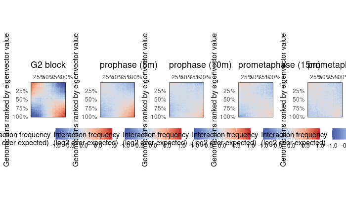

Workflow 2: Chromosome compartment cohesion upon mitosis entry
================
Vinson Zeng
March 28, 2024

The objective of this notebook is to develop working knowledge of how
to:<br> 1) Annotate compartments for a list of HiC experiments<br> 2)
Generate saddle plots for a list of HiC experiments<br> 3) Quantify
changes in interactions between compartments between different
timepoints

#### Load packages and objects

``` r
.libPaths('~/rlibrary')
setwd('~/repos/Hi-C_workshop')
library(rmarkdown)
library(ggplot2)
library(cowplot)
library(purrr)
library(HiCExperiment)
```

    ## Consider using the `HiContacts` package to perform advanced genomic operations 
    ## on `HiCExperiment` objects.
    ## 
    ## Read "Orchestrating Hi-C analysis with Bioconductor" online book to learn more:
    ## https://js2264.github.io/OHCA/

    ## 
    ## Attaching package: 'HiCExperiment'

    ## The following object is masked from 'package:ggplot2':
    ## 
    ##     resolution

``` r
library(HiContacts)
```

    ## Registered S3 methods overwritten by 'readr':
    ##   method                    from 
    ##   as.data.frame.spec_tbl_df vroom
    ##   as_tibble.spec_tbl_df     vroom
    ##   format.col_spec           vroom
    ##   print.col_spec            vroom
    ##   print.collector           vroom
    ##   print.date_names          vroom
    ##   print.locale              vroom
    ##   str.col_spec              vroom

``` r
library(HiContactsData)
```

    ## Loading required package: ExperimentHub

    ## Loading required package: BiocGenerics

    ## 
    ## Attaching package: 'BiocGenerics'

    ## The following object is masked from 'package:HiCExperiment':
    ## 
    ##     as.data.frame

    ## The following objects are masked from 'package:stats':
    ## 
    ##     IQR, mad, sd, var, xtabs

    ## The following objects are masked from 'package:base':
    ## 
    ##     anyDuplicated, aperm, append, as.data.frame, basename, cbind,
    ##     colnames, dirname, do.call, duplicated, eval, evalq, Filter, Find,
    ##     get, grep, grepl, intersect, is.unsorted, lapply, Map, mapply,
    ##     match, mget, order, paste, pmax, pmax.int, pmin, pmin.int,
    ##     Position, rank, rbind, Reduce, rownames, sapply, setdiff, sort,
    ##     table, tapply, union, unique, unsplit, which.max, which.min

    ## Loading required package: AnnotationHub

    ## Loading required package: BiocFileCache

    ## Loading required package: dbplyr

``` r
library(fourDNData)
library(BiocParallel)
library(GenomicRanges)
```

    ## Loading required package: stats4

    ## Loading required package: S4Vectors

    ## 
    ## Attaching package: 'S4Vectors'

    ## The following object is masked from 'package:HiCExperiment':
    ## 
    ##     metadata<-

    ## The following object is masked from 'package:utils':
    ## 
    ##     findMatches

    ## The following objects are masked from 'package:base':
    ## 
    ##     expand.grid, I, unname

    ## Loading required package: IRanges

    ## 
    ## Attaching package: 'IRanges'

    ## The following object is masked from 'package:purrr':
    ## 
    ##     reduce

    ## Loading required package: GenomeInfoDb

``` r
library(BiocManager)
BiocManager::install("WGCNA")
```

    ## Bioconductor version 3.18 (BiocManager 1.30.22), R 4.3.0 (2023-04-21)

    ## Warning: package(s) not installed when version(s) same as or greater than current; use
    ##   `force = TRUE` to re-install: 'WGCNA'

    ## Installation paths not writeable, unable to update packages
    ##   path: /opt/R/4.3.0/lib/R/library
    ##   packages:
    ##     boot, class, cluster, foreign, KernSmooth, lattice, MASS, Matrix, mgcv,
    ##     nlme, nnet, rpart, spatial, survival

    ## Old packages: 'bslib'

``` r
BiocManager::install("plyranges")
```

    ## Bioconductor version 3.18 (BiocManager 1.30.22), R 4.3.0 (2023-04-21)

    ## Warning: package(s) not installed when version(s) same as or greater than current; use
    ##   `force = TRUE` to re-install: 'plyranges'

    ## Installation paths not writeable, unable to update packages
    ##   path: /opt/R/4.3.0/lib/R/library
    ##   packages:
    ##     boot, class, cluster, foreign, KernSmooth, lattice, MASS, Matrix, mgcv,
    ##     nlme, nnet, rpart, spatial, survival
    ## Old packages: 'bslib'

### Import data from 4DN

Use the `fourDNData` gateway package to download the datasets.

``` r
samples <- list(
    '4DNES9LEZXN7' = 'G2 block', 
    '4DNESNWWIFZU' = 'prophase (5m)', 
    '4DNESGDXKM2I' = 'prophase (10m)', 
    '4DNESIR416OW' = 'prometaphase (15m)', 
    '4DNESS8PTK6F' = 'prometaphase (30m)' 
)
bpparam <- MulticoreParam(workers = 4, progressbar = FALSE)
hics <- bplapply(names(samples), fourDNHiCExperiment, BPPARAM = bpparam)
```

Inspect “prophase” (5m) data.

``` r
names(hics) <- samples
hics[["prophase (5m)"]]
```

    ## `HiCExperiment` object with 115,078,651 contacts over 4,109 regions 
    ## -------
    ## fileName: "/home/scatsac/.cache/R/fourDNData/3859a7a64e12e_4DNFINSJ2GYV.mcool" 
    ## focus: "whole genome" 
    ## resolutions(13): 1000 2000 ... 5000000 10000000
    ## active resolution: 250000 
    ## interactions: 7241470 
    ## scores(2): count balanced 
    ## topologicalFeatures: compartments(725) borders(3281) 
    ## pairsFile: N/A 
    ## metadata(3): 4DN_info eigens diamond_insulation

### Plot whole chromosome matrices

Iterate over each HiCExperiment object to visualize the 5 Hi-C maps on
chromosome 3 with `HiContacts`. The plots highlight the progressive
chromatin remodeling into condensed chromosomes after 5’ is released
from the G2 phase.

``` r
pl <- imap(hics, ~ .x['chr3'] |> 
    zoom(100000) |> 
    plotMatrix(use.scores = 'balanced', limits = c(-4, -1), caption = FALSE) + 
    ggtitle(.y)
)    
plot_grid(plotlist = pl, nrow = 1)
```

<!-- -->


### Zoom in on a specific chromosome section

``` r
#=== Format the compartment positions of chr. 4 segment
.chr <- 'chr4'
.start <- 59000000L
.stop <- 75000000L
coords <- GRanges(paste0(.chr, ':', .start, '-', .stop))
compts_df <- topologicalFeatures(hics[["G2 block"]], "compartments") |> 
    subsetByOverlaps(coords, type = 'within') |> 
    as.data.frame()
compts_gg <- geom_rect(
    data = compts_df, 
    mapping = aes(xmin = start, xmax = end, ymin = -500000, ymax = 0, alpha = compartment), 
    col = 'black', inherit.aes = FALSE
)

#=== Subset contact matrices to chr. 4, compute autocorrelation scores
g2 <- hics[["G2 block"]] |> 
    zoom(100000) |> 
    subsetByOverlaps(coords) |>
    autocorrelate()
```

    ## 

``` r
pro5 <- hics[["prophase (5m)"]] |> 
    zoom(100000) |> 
    subsetByOverlaps(coords) |>
    autocorrelate()

pro30 <- hics[["prometaphase (30m)"]] |> 
    zoom(100000) |> 
    subsetByOverlaps(coords) |>
    autocorrelate()

#=== Plot autocorrelation matrices
plot_grid(
    plotMatrix(
        subsetByOverlaps(g2, coords),
        use.scores = 'autocorrelated', 
        scale = 'linear', 
        limits = c(-1, 1), 
        cmap = bwrColors(), 
        maxDistance = 10000000, 
        caption = FALSE
    ) + ggtitle('G2') + compts_gg,
    plotMatrix(
        subsetByOverlaps(pro5, coords),
        use.scores = 'autocorrelated', 
        scale = 'linear', 
        limits = c(-1, 1), 
        cmap = bwrColors(), 
        maxDistance = 10000000, 
        caption = FALSE
    ) + ggtitle('Prophase 5min') + compts_gg,
    plotMatrix(
        subsetByOverlaps(pro30, coords),
        use.scores = 'autocorrelated', 
        scale = 'linear', 
        limits = c(-1, 1), 
        cmap = bwrColors(), 
        maxDistance = 10000000, 
        caption = FALSE
    ) + ggtitle('Prometaphase 30min') + compts_gg,
    nrow = 1
)
```

    ## Warning: Using alpha for a discrete variable is not advised.
    ## Using alpha for a discrete variable is not advised.
    ## Using alpha for a discrete variable is not advised.

<!-- -->


Autocorrelation coefficients of gene frequencies at a particular given
distance are proportional to the kinship at that distance. The
correlation matrices above indicate two different patterns of chromatin
compartment remodeling for this chromosome section. <br> The correlation
scores within compartment A between genomic bins are reduced but still
positive 5 min after G2 release, but become null 30 min later.<br> The
correlation scores within compartment B are essentially null after G2
release.

### Generating saddle plots

Use to measure observed vs expected interaction scores between or within
genomic loci for compartments A and B. They are used here to check if
the two regimes of chromatin compartment remodeling are observable
throughout the genome. Average observed vs expected interaction scores
are plotted in a 2D heatmap.

Group non-overlapping genomic windows typically between 10 and 50 bins
according to A/B compartment eigenvector value (lowest = strongest B
compartments, highest = strongest A compartments)

`pl <- imap(hics, ~ plotSaddle(.x, nbins = 38, BPPARAM = bpparam) + ggtitle(.y))`

`plot_grid(plotlist = pl, nrow = 1)`

<figure>

<figcaption aria-hidden="true">Figure 3. Saddle plots for observed vs
expected G2.</figcaption>
</figure>

The saddle plots above are congruent with the observations made for chr.
4, in which intra-B compartments interactions appear to be lost 5 min
after G2 release and intra-A interactions take up to 15 min after G2
release to disappear.

### Quantifying interactions within and between compartments

Quantifying interaction frequencies within or between A or B
compartments can be achieved by leveraging the replicate-merged contact
matrices at different timepoints. Extract observed vs expected
interaction scores at different timepoints using the A/B compartment
annotations from the G2 block.

``` r
#=== Extract the A/B compartments identified in G2 block
compts <- topologicalFeatures(hics[["G2 block"]], "compartments")
compts$ID <- paste0(compts$compartment, seq_along(compts))

#=== Iterate over timepoints to extract `detrended` (O/E) scores and 
#===compartment annotations
library(tibble)
library(plyranges)
```

    ## 
    ## Attaching package: 'plyranges'

    ## The following object is masked from 'package:IRanges':
    ## 
    ##     slice

    ## The following object is masked from 'package:stats':
    ## 
    ##     filter

``` r
df <- imap(hics[c(1, 2, 5)], ~ {
    ints <- cis(.x) |> ## Filter out trans interactions
        detrend() |> ## Compute O/E scores
        interactions() ## Recover interactions 
    ints$comp_first <- join_overlap_left(anchors(ints, "first"), compts)$ID
    ints$comp_second <- join_overlap_left(anchors(ints, "second"), compts)$ID
    tibble(
        sample = .y, 
        bin1 = ints$comp_first, 
        bin2 = ints$comp_second, 
        dist = InteractionSet::pairdist(ints), 
        OE = ints$detrended 
    ) |> 
        filter(dist > 5e6) |>
        mutate(type = dplyr::case_when(
            grepl('A', bin1) & grepl('A', bin2) ~ 'AA',
            grepl('B', bin1) & grepl('B', bin2) ~ 'BB',
            grepl('A', bin1) & grepl('B', bin2) ~ 'AB',
            grepl('B', bin1) & grepl('A', bin2) ~ 'BA'
        )) |> 
        filter(bin1 != bin2)
}) |> list_rbind() |> mutate(
    sample = factor(sample, names(hics)[c(1, 2, 5)])
)
```

Plot the changes in the observed vs expected interaction scores for A-B,
B-A, intra-A, or intra-B. Split the boxplots according to timepoints.

``` r
ggplot(df, aes(x = type, y = OE, group = type, fill = type)) + 
    geom_boxplot(outlier.shape = NA) + 
    facet_grid(~sample) + 
    theme_bw() + 
    ylim(c(-2, 2))
```

    ## Warning: Removed 66307 rows containing non-finite outside the scale range
    ## (`stat_boxplot()`).

<!-- -->


The boxplots indicate that the interactions between genomic loci for the
B compartment degrade more rapidly than those of the A compartment after
cells are released from G2 and begin to enter mitosis.
