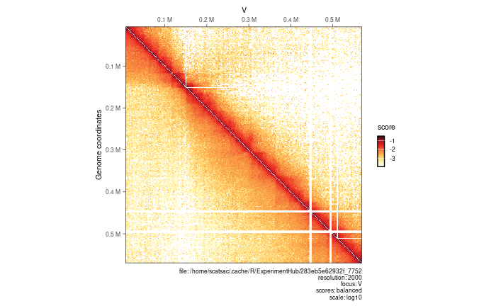

The objective of this notebook is to review the visualization tools in R offered by:<br>
1) `HiContacts`<br>
2) `HiCExperiment`

#### Load packages and objects
```{r}
library(ggplot2)
library(GenomicRanges)
library(InteractionSet)
library(HiCExperiment)
library(HiContactsData)
library(HiContacts)
library(rtracklayer)
```

### Visualizing Hi-C contact maps

#### Single map
Disk-stored Hi-C contact matrices can be visualized by importing the interactions of interest over a genomic location into a `HiCExperiment` object, followed by using `plotMatrix` from `HiContacts`.
```{r}
#=== generate example hic object
# create HiCExperiment object from example .cool file in HiContactsData package

# download `.mcool` file and cache locally
coolf <- HiContactsData('yeast_wt', 'mcool')

# create connection to disk-stored `.mcool` file
cf <- CoolFile(coolf)
cf

# import contacts from chromosome V at a resolution of 2000
hic <- import(cf, focus = 'V', resolution = 2000)

# plot the matrix
plotMatrix(hic)
```


#### Horizontal map

A horizontal style Hi-C map can be generated when providing a `maxDistance` argument to `plotMatrix`.
```{r}
plotMatrix(hic, maxDistance = 200000)
```


#### Side-by-side maps

Two Hi-C samples can be plotted side by side to compare interaction landscopes over the same genomic locus.
```{r}
# import a second `.mcool` file from Hi-C experiment performed in a eco1 yeast mutant
hic2 <- import(
    CoolFile(HiContactsData('yeast_eco1', 'mcool')), 
    focus = 'V', 
    resolution = 2000
)

#=== plot 2 matrices side by side - top right will be first matrix, bottom left will be second matrix
plotMatrix(hic, compare.to = hic2)
```


#### Plot multiple chromosomes

A Hi-C heatmap can be used to visualize interactions from multiple chromosomes through the following steps:<br>
1. Parse entire contact matrix in `R` <br>
2. Subset interactions over chromosomes of interest with `[` <br>
3. Use `plotMatrix` to generate the multi-chromosome plot

Step 1.
```{r}
# parse entire contact matrix
full_hic <- import(cf, resolution = 4000)
plotMatrix(full_hic)
```


Steps 2 and 3.

```{r}
# subset interactions over chromosomes of interest, plotMatrix
hic_subset <- full_hic[c("II", "III", "IV")]
plotMatrix(hic_subset)
```


### Hi-C maps customization options

The `plotMatrix` function has several customization options:
<ul>
  <li>pick scores of interest to represent in a Hi-C heatmap</li>
  <li>change numeric scale and boundaries</li>
  <li>change the color map</li>
  <li>extra customization options</li>
</ul>

```{r}
# plot count scores (un-normalized raw contact counts obtained from binning a .pairs file)
plotMatrix(hic, use.scores = 'count')
```


```{r}
# choose a scale by providing the `limits` argument
plotMatrix(hic, limits = c(-3.5, -1))
```


```{r}
# choose a colour map using `cmap`, ?HiContacts::palettes will show list of available colour maps
afmhotrColors() # this colour map is provided in the `HiContacts` package
plotMatrix(
    hic, 
    use.scores = 'balanced',
    limits = c(-4, -1),
    cmap = afmhotrColors()
)
```


### Advanced visualization

#### Overlaying topological features

Topological features such as chromatin loops, domain borders, and A/B compartments can be displayed over a Hi-C heatmap.

```{r}
# import pre-computed chromatin loops identified using`chromosight` on the contact matrix previously used to import interactions from

library(rtracklayer)
library(InteractionSet)
loops <- system.file('extdata', 'S288C-loops.bedpe', package = 'HiCExperiment') |> 
    import() |> 
    makeGInteractionsFromGRangesPairs()
loops
```

Borders have also been mapped with `chromosight` and can be imported in `R`.
```{r}
borders <- system.file('extdata', 'S288C-borders.bed', package = 'HiCExperiment') |> 
    import()
borders
```

`GInteractions` stores chromatin loops, displayed as off-diagonal circles. Borders are in `GRanges` and are displayed as on-diagonal diamonds in the Hi-C heatmap.

```{r}
plotMatrix(hic, loops = loops, borders = borders)
```


#### Aggregated Hi-C maps

"Snippets" (i.e. extracts) are typically aggregated together to display an average signal. This is sometimes referred to as "Aggregated Plot Analysis" (APA).<br>
The `aggregate` function can compute aggregated Hi-C maps over a collection of `targets`. Targets can be `GRanges` for on-diagonal snippets or `GInteractions` for off-diagonal snippets. Additionally, `flankingBins` specifies the number of matrix bins extracted on each side of the `targets` of interest.

```{r}
# compute aggregated Hi-C snippets of +/- 15kb around each chromatin loop listed in `loops`
hic <- zoom(hic, 1000)
aggr_loops <- aggregate(hic, targets = loops, flankingBins = 15)
aggr_loops
```

The `aggregate` function generates a `AggrHiCExperiment` object, which has an extra `slices` slot for arrays.

```{r}
slices(aggr_loops)
dim(slices(aggr_loops, 'count'))
topologicalFeatures(aggr_loops, 'targets')
```

The `AggrHiCExperiment` can be plotted with `plotMatrix`.

```{r}
plotMatrix(
    aggr_loops, 
    use.scores = 'detrended', 
    scale = 'linear', 
    limits = c(-1, 1), 
    cmap = bgrColors()
)
```

